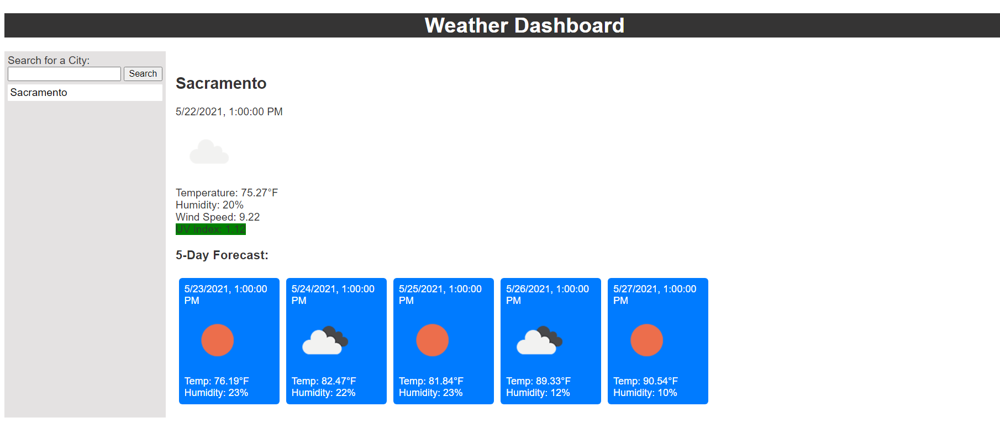

# Weather Application

## The Mission
This weeks challenge involved applying our skills to compose a website that would allow us to search for the weather of any City with the help of server-side APIs.
Using the helpful techniques such as fetch() we are able to access information from other sources and apply them to our very own website.  
This task allowed us to learn how to compose our skills and focus on the javascript side of the code.

### Site
https://azun510.github.io/WeatherApplication/

### Example of the Website

